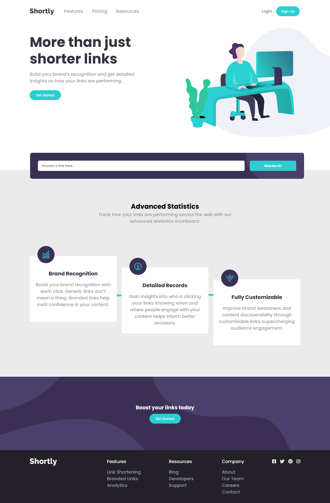

# Shortly URL shortening website

## Welcome! 👋

> This is a solution to the [Shortly URL shortening API Challenge challenge on Frontend Mentor](https://www.frontendmentor.io/challenges/url-shortening-api-landing-page-2ce3ob-G). Frontend Mentor challenges help you improve your coding skills by building realistic projects. 

## Table of contents ✔️

- [Overview](#overview)
  - [The challenge](#the-challenge)
  - [Screenshot](#screenshot)
  - [Links](#links)
- [My process](#my-process)
  - [Built with](#built-with)
  - [What I learned](#what-i-learned)
  - [Continued development](#continued-development)
  - [Useful resources](#useful-resources)
- [Author](#author)
- [Acknowledgments](#acknowledgments)

## Overview

### The challenge 😄

Users should be able to:

- View the optimal layout for the site depending on their device's screen size
- Shorten any valid URL
- See a list of their shortened links, even after refreshing the browser
- Copy the shortened link to their clipboard in a single click
- Receive an error message when the `form` is submitted if:
  - The `input` field is empty

### Screenshot ✔️

| |

 |


### Links

- [Github Respository](https://github.com/bobb-Rob/url-shortening-api-master)
- [live site](https://bobb-rob.github.io/url-shortening-api-master/)

## Built with ✔️

- Semantic HTML5 markup 🔥
- CSS 😋
- Flexbox
- CSS Grid
- Mobile-first workflow
- Webpack Bundler

### Continued development

> I plan the implementation of the following in future:
  - Design all navbar link sections
  - Subscribe to paid API and attached pricing on advance usage.


## Getting Started 🙌

To get a local copy up and running follow these simple example steps.

### Prerequisites
```
  node js
  npm

```
### Setup
Clone the repository and change the directory to portfolio

``` 
  `$ git clone https://github.com/bobb-Rob/url-shortening-api-master.git`

  `$ cd url-shortening-api-master`

```

### Install
Install all project dependencies by running the command below
 
``` 
 ` $ npm install`
```
### Usage

Run
``` 
  `$ npm start or deploy the index.html from the build folder 
```

### Deployment
- [Visit Application Homepage](http://localhost:3000)


## Author

| 👤 Name | Github | Twitter | LinkedIn ✔️ |
|------|--------|---------|----------|
|Robertson Akpan|[@bobb-rob](https://github.com/bobb-rob)|[@___Robertson](https://twitter.com/___Robertson)|[@RobertsonAkpan](https://www.linkedin.com/in/robertson-akpan-6895a0123/)|

## 🤝 Contributing

Contributions, issues, and feature requests are welcome!


## Show your support

Give a ⭐️ if you like this project!

## Acknowledgments

- Hat tip to Front End Mentors for inspiring this project.

## 📝 License